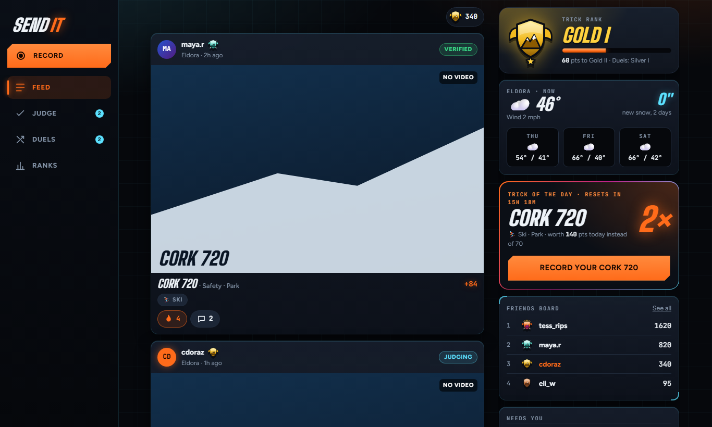
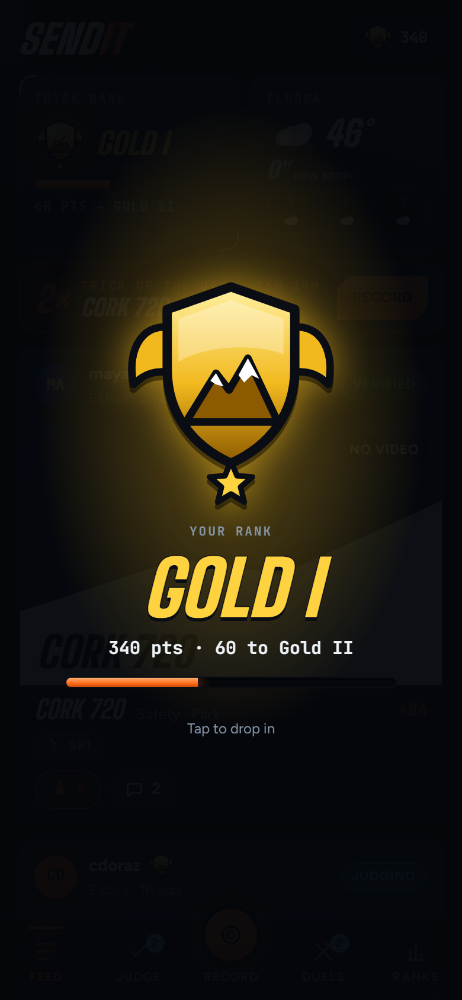
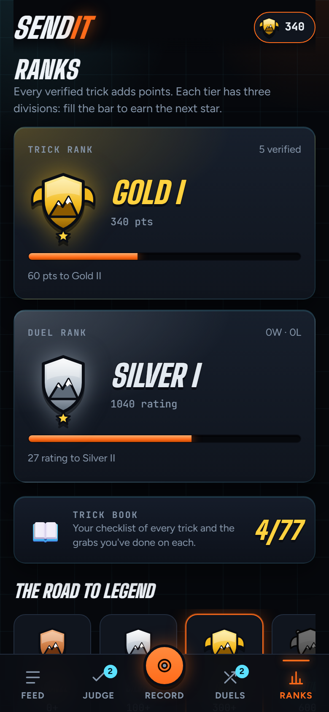

# Sendit

A social app for skiers and snowboarders. Film a trick in the app, other riders verify it, and verified
tricks earn points that rank you up from Bronze to Legend. Challenge friends to Game of S.K.I. duels.

**Live: https://connorusingai.github.io/sendit/** · installable to your phone's home screen, works with no signal

  

  
  

## What's in it
- **Record in the app** (no uploads of old videos), ski or snowboard, 77 tricks including switch and rails
- **Community verification:** anonymous, swipe-through judging; higher ranks' votes count more
- **Points that can't be farmed:** each trick pays once, a new grab on it pays a little, repeats pay nothing
- **Game-style ranks** on an upward curve, with divisions, badges, and a Trick Book checklist with tips
- **Game of S.K.I. duels** with friends, scored by chess-style ELO
- **Crews:** team up with friends or a ski club, join with a 6-letter invite code, and climb the crew leaderboard together
- **Trick of the Day** (2x points), live mountain conditions, achievements, a friends leaderboard
- **Works on the mountain:** clips wait on the phone with no signal and upload when it comes back

## How it's built
- One HTML file of plain JavaScript, hosted on GitHub Pages as an installable app (PWA)
- **Supabase** (Postgres) for accounts, video storage and data. Every rule that matters (points,
  verification, duel turns, who can write what) is enforced *inside the database* with row-level
  security and SQL functions, so the app can't be used to cheat. See [`supabase/`](supabase/).
- The database rules have their own test suite that runs on a throwaway Postgres:
  [`supabase/tests/test_rules.py`](supabase/tests/test_rules.py)
- A separate project, **Sendit AI**, is learning to verify tricks from video (spin, axis, airtime, landed).

## The core loop

1. **Film** a trick (a friend films you, or you use a GoPro or 360 camera).
2. **Pick the trick** from a list, e.g. "Cork 720, Safety grab".
3. **Post.**
4. **Get verified** and earn points. The skier just gets a notification: "✅ Verified, +84 pts".

Keep the skier's side this simple. All the checking happens in the background.

## Status

| Piece | State |
|---|---|
| Clickable prototype | ✅ [`prototype/index.html`](prototype/index.html), fake users, saves in your browser only · [live link](https://claude.ai/artifact/R2RN1gjaBDJzi2VtuPRERC) |
| Real accounts + shared database | ✅ Supabase. Schema in [`supabase/`](supabase/), rules tested by [`supabase/tests/test_rules.py`](supabase/tests/test_rules.py) |
| Live app | ✅ **https://connorusingai.github.io/sendit/** (the real app, [`app/index.html`](app/index.html)) |
| Mobile app | ⬜ Not started |
| AI verification | 🔨 Separate project, Sendit AI (private for now) |

To run the real app locally, double-click `app/run.bat`. To run the old prototype, open `prototype/index.html`.

## Roadmap

1. **Prototype** (done): test whether the idea feels fun.
2. **Real backend**: sign-in, video uploads, shared leaderboard, so friends can use it together.
3. **Plug in the AI**: clips that `sendit-ai` is confident about get verified instantly, and only unsure ones go to people.
4. **Launch small**: CU ski club and the Eldora park crew first, not everyone.

See [FEATURES.md](FEATURES.md) for every feature and the reasoning behind it.
